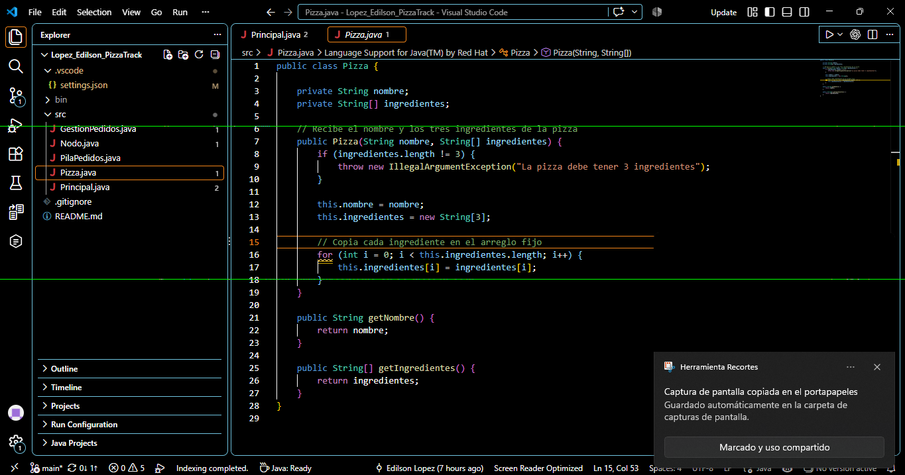
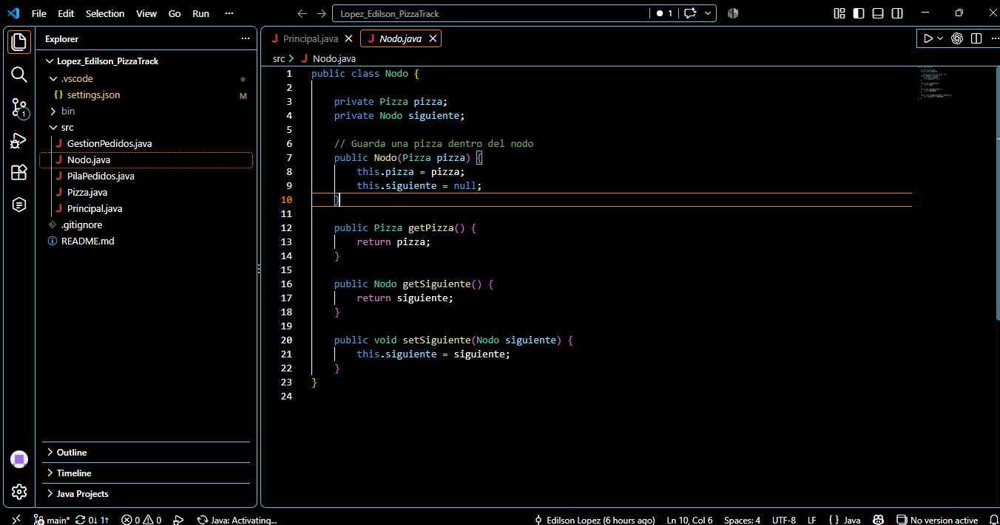
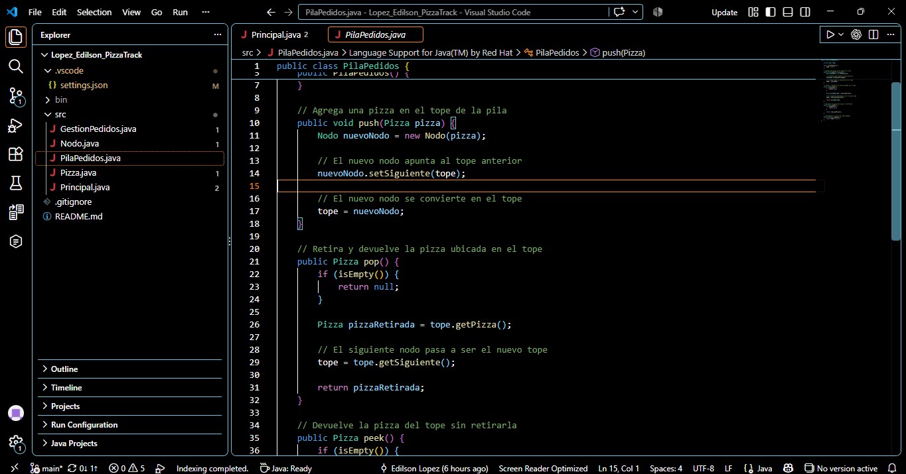
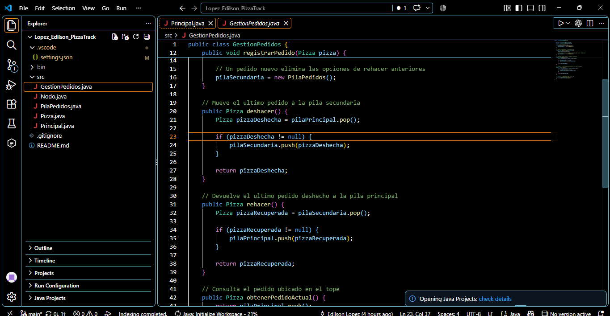
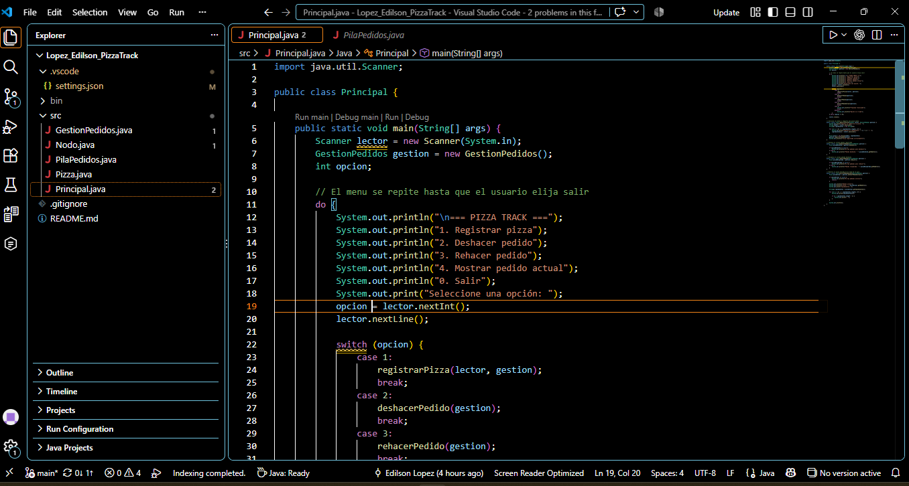
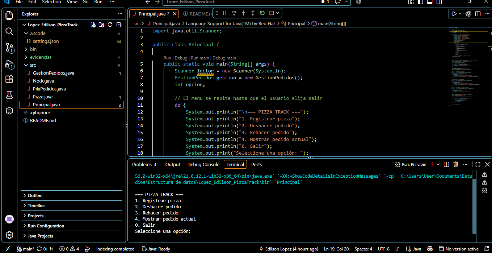
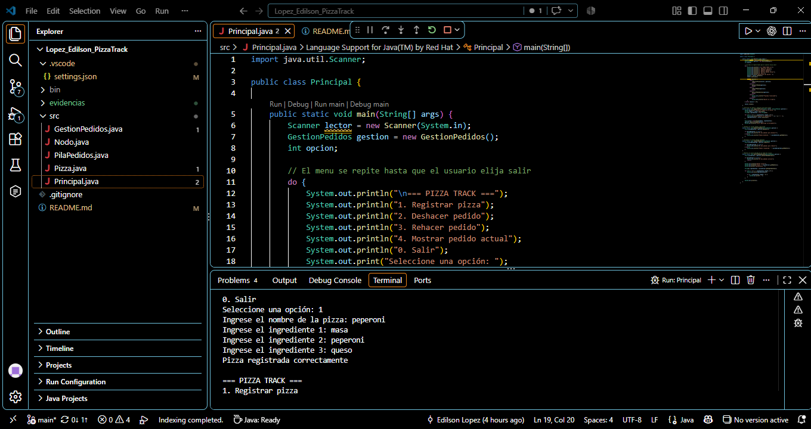
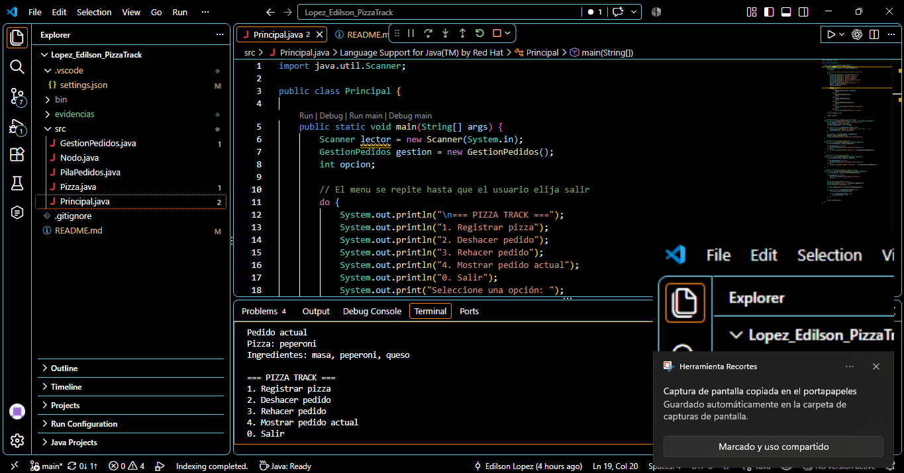
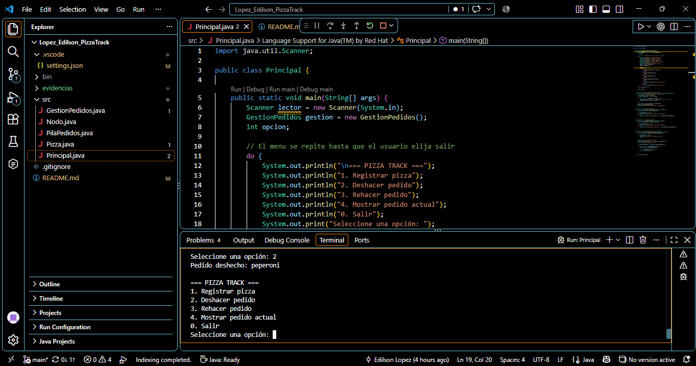
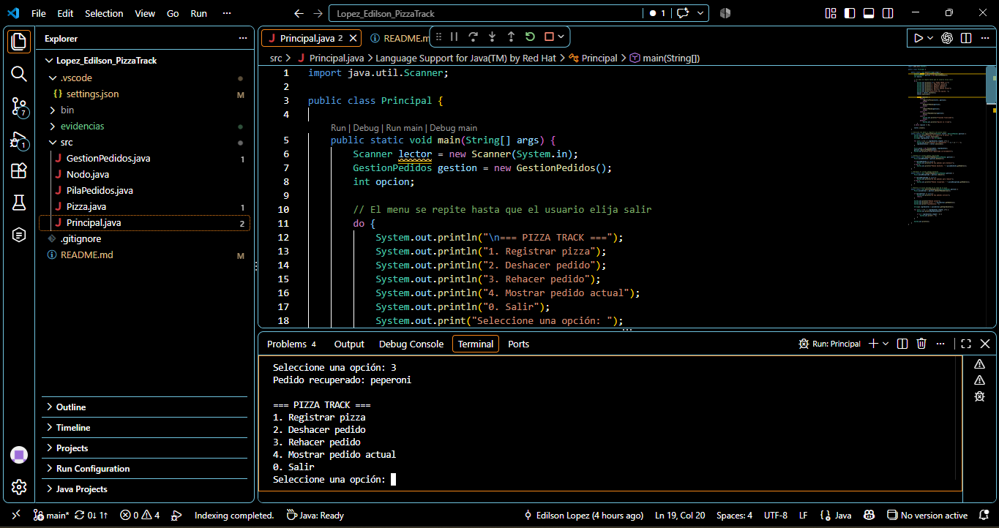

# Pizza Track

**Estudiante:** Edilson Lopez  
**Evidencia de aprendizaje:** Implementación de pilas con Undo y Redo

## Objetivo

Desarrollar una aplicación en Java que permita comprender el funcionamiento de una pila y su estructura lógica mediante un sistema de gestión de pedidos para una pizzería

## Descripción

Pizza Track permite registrar pizzas y administrar los pedidos mediante las operaciones deshacer y rehacer

El programa utiliza dos pilas manuales construidas con nodos y listas ligadas sin utilizar la clase `java.util.Stack`

- La pila principal almacena los pedidos activos
- La pila secundaria almacena temporalmente los pedidos deshechos
- Cada pizza contiene un nombre y un arreglo fijo de tres ingredientes

## Funciones del programa

1. Registrar una pizza con su nombre y tres ingredientes
2. Deshacer el último pedido registrado
3. Rehacer el último pedido deshecho
4. Mostrar el pedido actual sin retirarlo de la pila
5. Finalizar el programa desde el menú

## Métodos de la pila

- `push()` agrega una pizza en el tope
- `pop()` retira y devuelve la pizza del tope
- `peek()` consulta la pizza del tope sin retirarla
- `isEmpty()` comprueba si la pila está vacía

## Herramientas utilizadas

- Visual Studio Code
- Eclipse Temurin JDK 21
- Extension Pack for Java
- Git y GitHub

## Estructura del proyecto

```text
Lopez_Edilson_PizzaTrack
├── .vscode
│   └── settings.json
├── evidencias
│   ├── deshacer-pedido.png
│   ├── ejecucion-menu.png
│   ├── gestion-undo-redo.png
│   ├── menu-principal.png
│   ├── modelo-pizza.png
│   ├── nodo-lista-ligada.png
│   ├── pedido-actual.png
│   ├── pila-push-pop.png
│   ├── registro-pizza.png
│   └── rehacer-pedido.png
├── src
│   ├── GestionPedidos.java
│   ├── Nodo.java
│   ├── PilaPedidos.java
│   ├── Pizza.java
│   └── Principal.java
├── .gitignore
└── README.md
```

## Cómo ejecutar el programa

1. Abrir la carpeta del proyecto en Visual Studio Code
2. Abrir el archivo `src/Principal.java`
3. Presionar el botón `Run Java`
4. Seleccionar la opción 1 para registrar una pizza
5. Ingresar el nombre y los tres ingredientes
6. Utilizar las opciones del menú para deshacer rehacer o consultar el pedido actual
7. Seleccionar la opción 0 para finalizar

## Ciclo de prueba recomendado

1. Registrar una pizza
2. Mostrar el pedido actual
3. Deshacer el pedido
4. Comprobar que no existen pedidos activos
5. Rehacer el pedido
6. Mostrar nuevamente la pizza recuperada

## Evidencias del desarrollo

### Modelo de datos Pizza



### Nodo de la lista ligada



### Métodos push y pop de la pila manual



### Gestión de las operaciones Undo y Redo



### Menú principal



### Prueba de funcionamiento en consola

#### Menú de Pizza Track



#### Registro de una pizza



#### Consulta del pedido actual



#### Operación deshacer



#### Operación rehacer



## Enlaces

- Repositorio público: [Lopez Edilson Pizza Track](https://github.com/edilsonlopez-bit/Lopez_Edilson_PizzaTrack)
- Video de sustentación: https://drive.google.com/file/d/15zsrXyci-rKHe2gcLxmduegHyA9fuWsH/view?usp=drive_link
